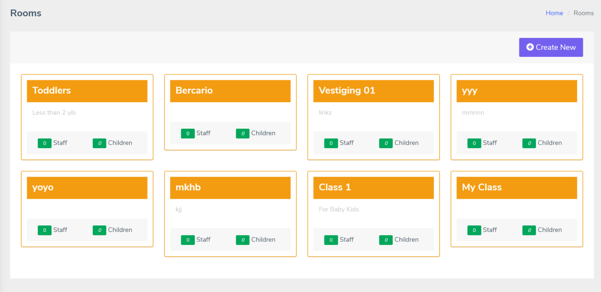
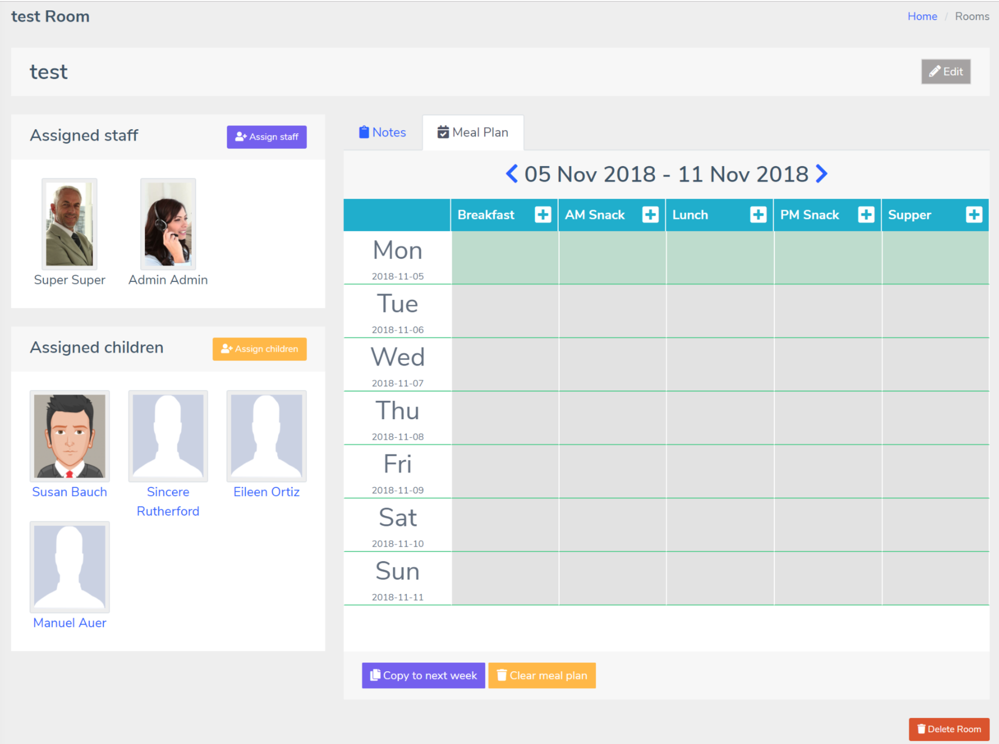

# Rooms

> Rooms provide an easy way to manage day care by assigning teachers to specific group of children

## Creating a room

* Click on "Create New" button to launch a new room form modal
* Fill the name of the room and a brief description of the purpose of the room
* Click "Submit" to save

## Assigning staff members and children

* Click "Assign staff" button
* Click checkbox next to the staff member's name
* Click "Submit" to save
* To remove a staff member, simply uncheck the box next to their name
* Repeat these steps for assigning children

## Notes

Room notes provide a simple chat-style communication board for staff and parents. Notes entered in this area are visible to everyone with access to that room.

You can permanently delete your own notes at any time. 

Admins and managers can delete anyone's notes.

You can search notes by date or content.

## Meal planner

Each room has its own meal plan.
By default, this week's meal plan is displayed. Use navigation buttons to see other weekly plans.

To simplify planning, we have added ability to copy this week's plan into next week. You can also clear all the contents of this week.

Clicking on a meal item will prompt you to delete that item. There is no editing capability, rather, you can just delete an item and add a new one in its place.

To add a new item, click on the + (plus) icon next to the meal type e.g. Breakfast. Select the date, add the name of the food item and save.